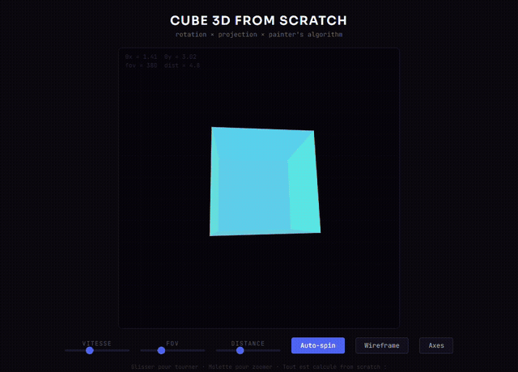

# Cube 3D

A 3D cube rendered from scratch in the browser using HTML Canvas with interactive controls.

## Features

- Real-time 3D cube rendering
- Interactive rotation controls
- Built with vanilla HTML, CSS, and JavaScript
